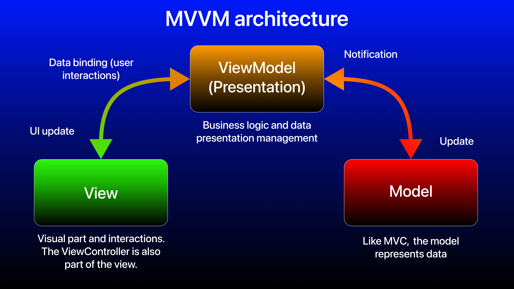
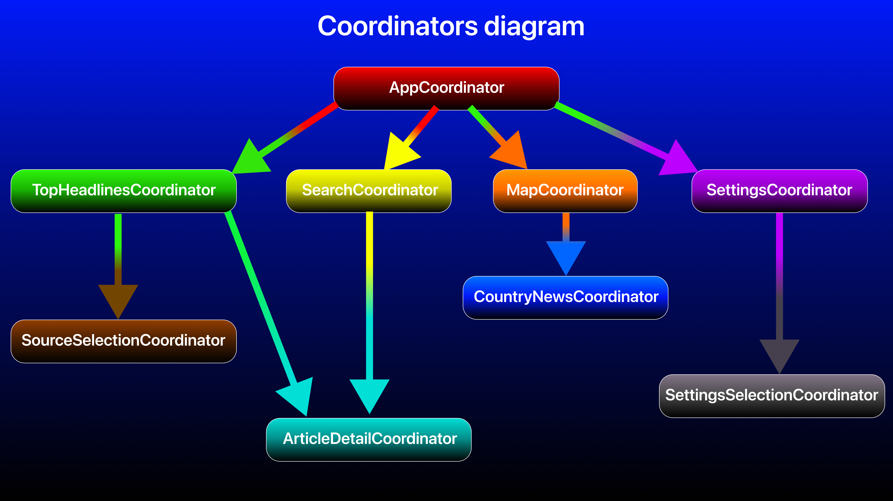
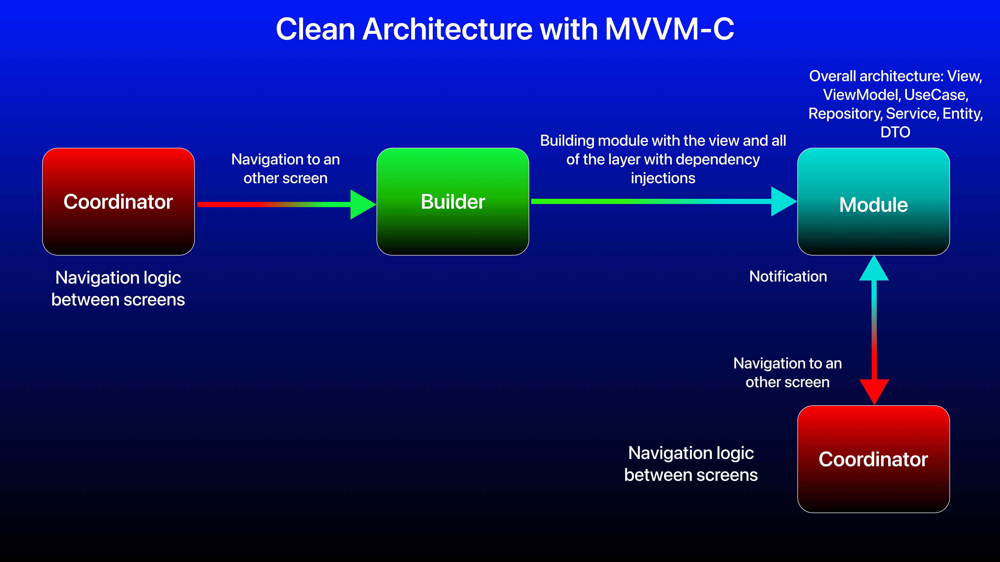
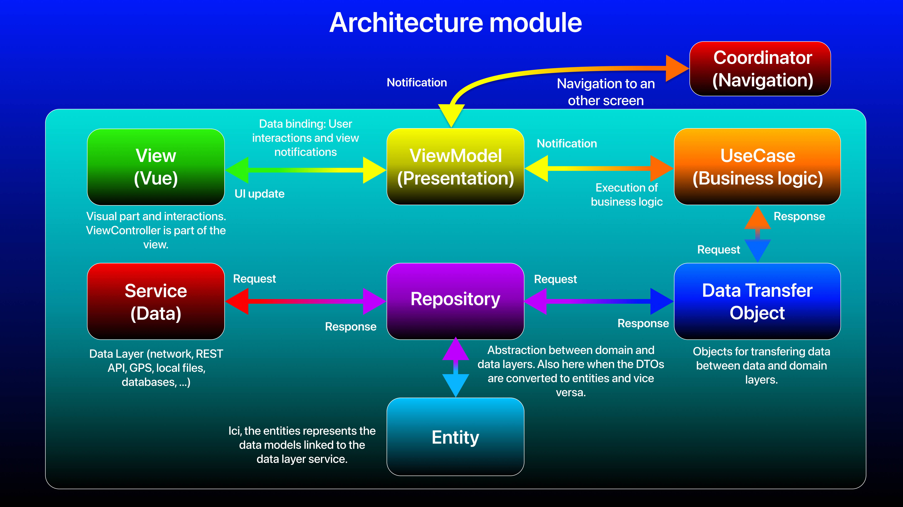
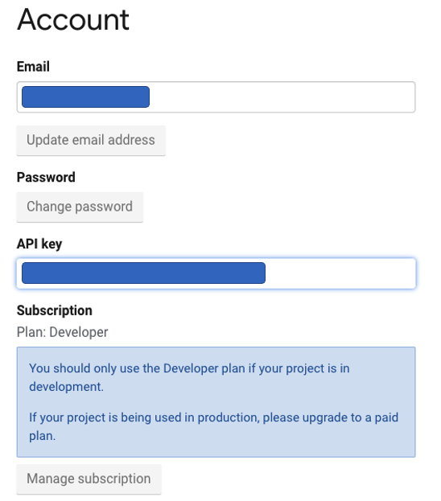
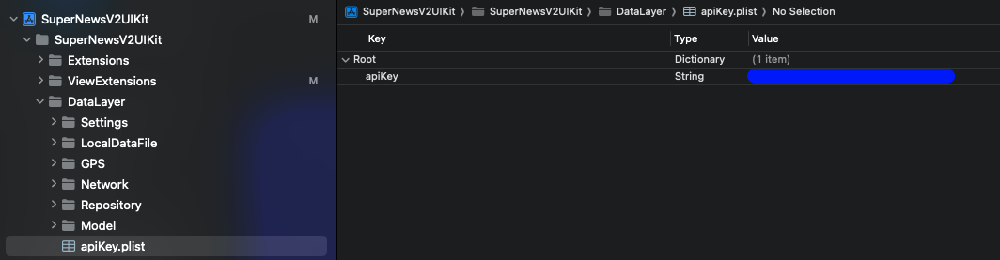
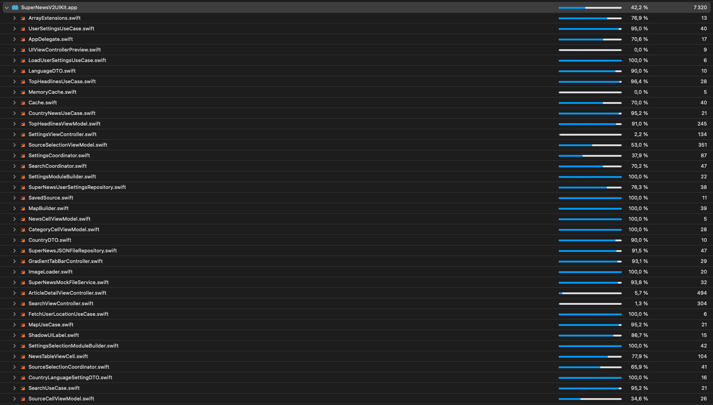
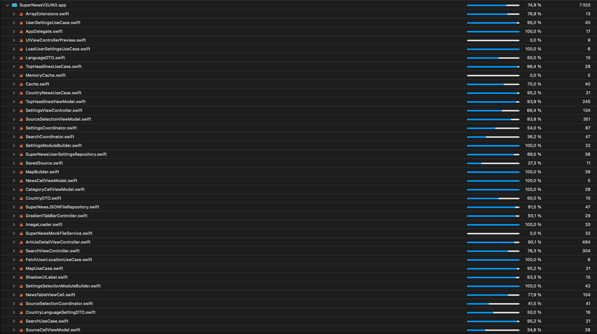
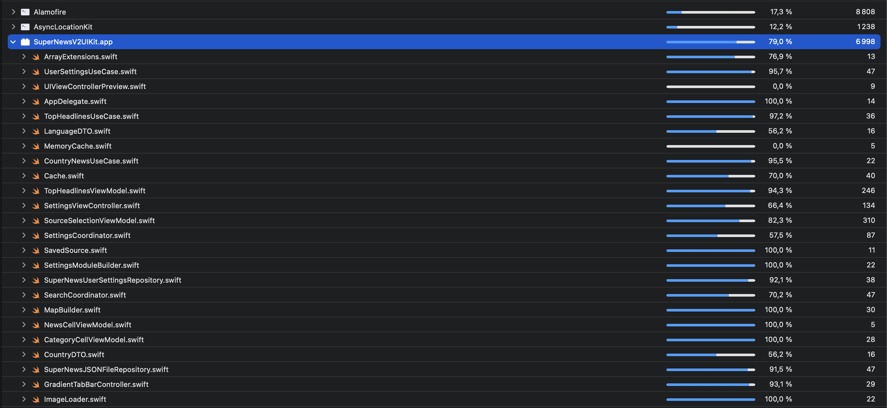

# SuperNews iOS V2 UIKit (English)

## Navigation plan
- [A brief history](#story)
- [Technical stack and architecture](#stack)
    + [Technical stack](#technology)
    + [Architecture](#architecture)
    + [Design patterns](#patterns)
    + [Architecture recap](#recap)
- [Important: before trying the iOS app](#important)
- [Features and screenshots](#features)
    + [Top headlines](#topHeadlines)
    + [Source selection for news](#sourceSelection)
    + [News search](#newsSearch)
    + [News map](#map)
    + [Detailed article view](#articleDetail)
    + [User settings](#settings)
- [Unit and UI tests](#testing)

## <a name="story"></a>A brief history

For this personal project which is **SuperNews**, everything starts in **2020**. 

I was doing my end-of-study internship with Capgemini, in Paris, more precisely in Issy-les-Moulineaux. My goal there was to be able to practice into the native iOS development, a job and a technology I've enjoyed immensely, being also a long-time Apple ecosystem enthusiast.

Internally, within the Paris DCX (Digital Customer eXperience) Mobile Factory Business Unit, during with iOS upskilling, one of the internal iOS leads suggested a technical exercise (as a technical test). And the technical test was the following:
- Develop an app that uses the **NewsAPI** REST API to display the articles in a `TableView`. On tap on an article, the article is displayed (`push` transition) in a new screen. This new screen displays the article details.

The goal is to show what we learned to use an API but above all to do so with different architectures, from classic **MVC**, to **MVVM** up to the **Clean Architecture** (**Clean Swift** variant). At the time, I had only carried out this test in **MVC**.

To see this technical test in detail, with my realizations that I redid in February 2023, [click here](https://github.com/Kous92/Test-technique-iOS-2020-Capgemini-Mobile-Factory-DCX-Paris).

**July** comes, in the lockdown of the worldwide **COVID** health crisis that we know, my internship stops here, and I was refused a permanent contract (due to a lack of customer projects and my insufficient technical level). I'm investing in a Mac mini so that I can continue my progress in native iOS despite the morale at his lowest level.

Over the monthes, I'm doing job interviews, almost everytime with IT consulting companies, and here, given my background, is a question I'm asked quite frequently: **Do you have made any personal projects ?**

And that's when it got me thinking about an idea, because there, you really had to pull out all the stops to show something concrete, a complete project, with outstanding features, because yes, a basic **TODO list** interface or only a `TableView` who downloads data from a **REST API**, it won't make the job. You have to go further. But before going further, the challenge here, is to have the server resources to make a concrete project, therefore a **REST API**. In general, it's not cheap when you don't have the financial means, so you're limited in the features you can offer.

We are in **March 2021**, it was then that I remembered what I have done during my end-of-study internship at Capgemini, my technical test. Having kept the subject and my code, so I took the opportunity to consult [NewsAPI documentation](https://newsapi.org) in depth. By consulting the different possible features, I have build my first app with the following features:
- Top headlines of favorite country.
- News search (in different languages)
- News map, my outstanding signature feature, by selecting a country from his marker, to consult the local top headlines of the related country.
- User settings: set the news search language and the country for the favorite top headlines.

On the technical side, I started with the following stack:
- **Xcode 12**, **Swift 5.4**, **UIKit** with **Storyboard**, **MVC** architecture (**UIKit** default one), **MapKit**, **CoreLocation**, **Alamofire** and **Kingfisher** as 3rd party installed framework with **CocoaPods**. For **unit and UI tests**, it's a beginning.

This first version took me 2-3 months to complete, which I then published on **GitHub**. [This old version is consultable here](https://github.com/Kous92/SuperNews-iOS-Swift5/tree/mvc).

Although I've done my utmost to promote this achievement, technically, it's not enough. I had to figure it out during the few (rare) technical tests and reviews I was able to have.

**October 2021**, I lauch the migration phase to **MVVM** architecture, It took me a lot of time to finally understand how to implement this architecture with **UIKit**, I was very lost with all of that things on the Internet. I've redesigned the user interface, I have started to isolate the business logic from the view, and implemented the use of **Combine** for the **data binding** between the **view** and the **ViewModel** (even if **RxSwift** is great for **UIKit** with **MVVM** architecture).

With these improvements, I felt a clear improvement in terms of logic, maintainability and unit tests (better code coverage). But over the time, I felt that I must do even better (on the one hand, because the job market is more and more technically demanding).
I published this new version on **GitHub** in december 2021, [that you can consult here](https://github.com/Kous92/SuperNews-iOS-Swift5/tree/main).

The technical stack was the following:
- **Xcode 13**, **Swift 5.5**, **UIKit** with **Storyboard**, **MVVM** architecture, **Combine**, **MapKit**, **CoreLocation**, **Alamofire** and **Kingfisher** as 3rd party installed framework with  **CocoaPods**, **XCTest** for **Unit and UI tests**.

This project version was for me, **"my loyal ally"** which I presented at every job interview to demonstrate my skills because it's a challenge as a junior to get a job as an iOS developer, very difficult due to actual economic context and customers requirements (IT consulting companies, recruitment offices).

**2022**, I manage to work at **Netgem** and **Withings**, for a 3 month period each. Then, at the end of **2022** and beginning of **2023**, I was committing myself to **"neo IT consulting company"** for recruitement on profile, so with a beggining as soon as a customer mission is won. That's when I became more aware than ever of advanced architectures (**MVP**, **VIPER**, **Clean Swift**, ...), of Software Craftsmanship principles (**KISS**, **DRY**, **YAGNI**, **SOLID**,...), to begin with **SwiftUI**, ...

The market situation was becoming very complicated (my commitment to the company ends here), and with all that I learned, I set myself a challenge, in **april 2023** to remake this app from scratch, but much more improvede: more advanced architecture, application of Software Craftsmanship principles (**KISS**, **DRY**, **YAGNI**, **SOLID**, **design patterns**, ...), but also with new features. Despite low morale (once again) and a break, the goals of this new version was the following:
- To be able to fully benefit advices from experienced/expert developers during code reviews to improve my code, making my app more performant, making better unit tests, ...
- To be in real condition when putting the app in production, first on **TestFlight** and maybe on the **App Store** if there is not too much constraints from the API, or anything else.
- To be confronted with more technical situations that I might encounter in a professional environment (framework migration, UI/UX optimizations, multithreading, production startup, ...).
- To do this same version of this iOS app in **SwiftUI**.
- To feel more and more confident, to be ready to look for a company again and find again a job as an iOS developer, by being better armed (from technical tests until validation of the trial period).

Here, we are in **September 2023**, and I show you my new version of **SuperNews**, that I publish for the first time on **TestFlight** through **App Store Connect**.

Moral: when the market is tight and you need to show recruiters, clients, **iOS leads** and project managers something concrete, personals projects are a good way to show his skills on a project even if this project won't be as complete ad a real project in company the fact that our technical resources are limited. A rich and complete personal project also tells the story behind this achievement

Ideally, is that this realization will be available on the **App Store**, but putting in to **TestFlight** is a big step, because not everyone can invest upfront 99$/year for the **Apple Developer Program** to have access to these resources.

On the next parts, you will have a full project description, at technical level, features and tests.

## <a name="stack"></a>Technical stack and architecture

In this section, I describe in detail the technical solution implemented in this project.
### <a name="technology"></a>Technical stack

Regarding technical stack, meaning the set of frameworks, technologies and tools that are used, here's what I propose below.

**Technology:**

The technical environment is **100% native iOS**, meaning with **<u>Apple's official technologies</u>**:
- **Xcode**: Official IDE for native iOS apps development. First with **Xcode 14** then **Xcode 15**.
- **Swift**: Apple's official programming language, used for every iOS app components. **Used version: 5.9**.

**Tools:**

There is the different tools that I use in this project:
- **Swift Package Manager**: Apple's official tool, a package manager directly integrated with **Swift** and **Xcode**, very useful to install and update 3rd party frameworks like **Alamofire**, **Kingfisher**, **RxSwift**...
- **GitHub**: An online code hosting platform for version control and collaboration with **Git**. It's here where all of the code and file history from the beginning to now.
- **Postman**: Tool to test the **REST APIs (web services)** with the different **HTTP** request than an **API** can propose.
- **App Store Connect**: Apple's official plateform for the management of the release of **iOS** and other Apple platform apps. This platform allows to publish apps on **TestFlight** and the **App Store**. It's through **Xcode** that the apps are archived and uploaded on **App Store Connect**.
- **TestFlight**: Plateform to test easily Apple platform beta version apps providing developers with valuable feedback from testers before publication on the **App Store**.

**Frameworks:**
- **UIKit**: Apple's historical **UI** framework to create native **iOS** application interfaces. This framework allows to build views in an imperative way (especially complex views with advanced animations), through step by step instruction to define a specific task. **UIKit** works through constaints (**Auto Layout**) to position views on screen. There are 3 ways to create views (programmatically, XIB or Storyboard), I choose to do it programmatically.
- **SwiftUI**: Apple's new generation **UI** framework released in 2019, which allows by a declarative way to build and live preview the views, through objects where we describe directly the properties (couleur, positionnement, taille, forme, ...). Here, I use it for live preview part for my views that I have realized with **UIKit** (especially the `ViewController`).
- **Swift Concurrency**: Integrated in **Swift** language since version **5.5**, framework that allows asynchronous tasks management and multithreading with a lighter and easier to read syntax (`async`, `await`, `actor`, `Task`, `@MainActor`)
- **MapKit**: Apple's **UI** allowing to use the iOS interactive map in a custom way (view, interactions,...).
- **Core Location**: Apple's framework for GPS location services.
- **Combine**: Apple's framework for reactive programming (equivalent of **RxSwift**), meaning with asynchronous data flows. The goal is to allow an entity to subscribe to a data stream and react at every event to execute actions. Used here for `data binding` of **MVVM** architecture.
- **XCTest**: Apple's framework for unit and UI tests.
- **SnapKit**: 3rd party framework tiers to for easier management of view constraints (**Auto Layout**). Note: with **SnapKit**, **UIKit** views are only made by code.
- **Kingfisher**: 3rd party framework to download from Internet and cache images in an asynchronous way.
- **Alamofire**: 3rd party framework to use in more elegant way the network requests.
- **AsyncLocationKit**: 3rd party framework to use `CoreLocation` with **Swift Concurrency** (`async/await`) logic instead of `delegate` or **completion handlers**.

My application supports also **localization**, currently in french and english, and I use the new Xcode 15 feature which is **String catalog** (`.xcstrings` format), which is easier to set and use than the older way.

### <a name="architecture"></a>Architecture

For this new version of **SuperNews**, the architecture has been reworked, starting with the **MVVM** version, but this time with a new set of **Software Craftsmanship** principles (design patterns, **Clean Code**, **SOLID**, ...). This base of **MVVM** is now nested in a **Clean Architecture**. Also for the navigation part, `Coordinator` is used, giving the **MVVM-C** variant.

I will describe below the architecture (**Clean Architecture with MVVM-C**) and the patterns that are used into this project.

### The Clean Architecture

The **Clean Architecture**, by Robert C. MARTIN (aka Uncle Bob), is an architecture principle allowing to organize and separate responsibilities in layers. This principle is independent of any technology, platform and also any architecture, indeed, we can use architectures like **MVVM**, **MVP**, **VIP**, **VIPER**,... and nest them in a **Clean Architecture** by applying the layer principles.

The 4 layers are represented in the diagram below by concentric circles running from outside to inside, each one having its responsibility:
- **External (UI or database)**: Visual part of the application or database, depending of the platform and the application.
- **Presentation**: The part which receives the user inputs to execute a specific use case (with or without input data) and also allowing to and also to set up output data in order to notify external layer to update itself with these new data.
- **Use case**: Specific business logicto a use case (REST API network call, fetching date from a database for a UI app, synchronization with a service, ...)
- **Entities**: Data models representing a specific logic. We call also this layer, domain.

Note: depending on platforms and implementations, **use case and entities** may become one for the **domain layer**.

<br>

Thanks of this layer organization, the **Clean Architecture** ensures independence, guaranteeing a flexible code being:
- **Independent of frameworks**: frameworks and 3rd party librairies must be thought as tools, not restrictive frameworks.
- **Independently testable**: tests must be able to be performed without dependencies between parts, and without any dependency to external elements (API, databases, …).
- **Independent of UI**: the UI must be easy to modify.
- **Independent of database**
- **Independent of any service or external system**: In short, the code must be independent of third parties over whom it has no control.

Concernant la relation entre couches, seule une couche extérieure (supérieure) peut dépendre d'une couche intérieure (inférieure), et non l'inverse. De plus chaque couche étant indépendante, la dépendance se fait par le biais d'abstraction, et non de concret. Le dernier principe du **SOLID** s'applique alors, étant l'**inversion de dépendances (D: Depency Inversion)**. Cette architecture permet de s’assurer que les changements apportés sur les couches supérieures n’aient aucun impact sur les couches inférieures, et donc de maintenir une application stable aussi bien au cours de mises à jour de ressources externes, que de tests ou d’évolutions (changement de frameworks, de base de données, etc.).

La **Clean Architecture** va donc faciliter la maintenance et la testabilité du code (adaptée pour la mise en place du **TDD: Test Driven Development**).

Si j'ai correctement appliqué les principes de la **Clean Architecture**, la migration de mes composants peut en théorie se faire plus facilement, comme par exemple si je voudrais passer de **UIKit** vers **SwiftUI** (à condition que les vues soient adaptées aux composants d'architecture, étant donné que les vues **SwiftUI** sont des vues de type valeur et non de type référence avec les vues **UIKit**).

### MVVM architecture (Clean Architecture's presentation layer)

L'architecture **MVVM** (**Model View ViewModel**) est un design pattern qui permet de séparer la logique métier et les interactions de l'interface utilisateur (UI). Cette architecture se compose en 3 éléments:
- Le **modèle (Model)** représente les différents modèles de données de l'application.
- La **vue (View)** représente l'UI (interface graphique) et les interactions utilisateurs (appui sur un bouton, saisie de texte, ...).
- La **vue modèle (View Model)** est l'intermédiaire entre la vue et le modèle. Ses responsabilités sont de réagir aux actions de l'utilisateur, de gérer la logique métier (ici, récupérer les données du modèle), de formater les données récupérées et mettre à jour la vue en disposant d'attributs que la vue affichera par le biais du data binding (liaison de données).

En **MVVM**, la vue ayant une référence avec la vue modèle, **<u>mais pas l'inverse</u>** (chose qui s'applique avec l'architecture **MVP**), la vue va donc s'abonner à des événements qu'émet la vue modèle.

Le `data binding` est un lien entre la vue et la vue modèle, où la vue par le biais des interactions avec l'utilisateur va envoyer un signal à la vue modèle afin d'effectuer une logique métier spécifique. Ce signal va donc permettre la mise à jour des données du modèle et ainsi permettre l'actualisation automatique de la vue. Le `data binding` en iOS peut se faire par:
- Délégation (déconseillée, plus appropriée pour l'architecture **MVP**, **VIPER**, **Clean Swift (VIP)**)
- Callbacks (closures)
- Programmation réactive fonctionnelle (**RxSwift**, **Combine**), la solution que j'ai retenue ici dans ce projet, avec **Combine**.

<br>

- Principaux avantages:
    + Architecture adaptée pour séparer la vue de la logique métier par le biais de ViewModel
    + `ViewController` allégés.
    + Tests facilités de la logique métier (Couverture du code par les tests renforcée)
    + Adaptée avec **SwiftUI**, **MVVM** est même l'architecture de base.
    + Adaptée pour la programmation réactive (**RxSwift**, **Combine**)

- Inconvénients:
    + Les `ViewModel` deviennent massifs si la séparation des éléments ne sont pas maîtrisés, il est donc difficile de correctement découper ses structures, classes et méthodes afin de respecter le premier principe du **SOLID** étant le principe de responsabilité unique (**SRP: Single Responsibility Principle**). La variante **MVVM-C** qui utilise un `Coordinator` s'avère utile pour alléger les vues et gérer la navigation entre vues.
    + Potentiellement complexe pour des projets de très petite taille.
    + Inadaptée pour des projets de très grande taille (surtout si la logique métier est massive), il sera préférable de passer à l'architecture **VIPER** ou à la Clean Architecture (**VIP (Clean Swift)**, **MVVM**, ...). **MVVM** est donc intégrable dans une **Clean Architecture**, ce qui est le cas ici dans ce projet.
    + Maîtrise compliquée pour les débutants avec **UIKit**, mais plus simple avec **SwiftUI** (étant l'architecture "par défaut").

### The MVVM-C variant with Coordinator

Étant donné qu'avoir un code bien découplé et qui respecte au mieux le premier principe du **SOLID** étant le principe de responsabilité unique, l'architecture **MVVM** doit être modifiée étant donné qu'elle ne respecte pas ce principe. Pour cela, en plus d'isoler la logique métier dans la couche domaine, la navigation sera elle isolée dans une entité dédiée qu'est le `Coordinator`. **MVVM** + `Coordinator` = **MVVM-C**.

Le `Coordinator` est un pattern qui organise la logique de flux de navigation entre les différents écrans (ViewController) et qui isole la logique de navigation de l'interface utilisateur.

L'objectif principal du `Coordinator` est de rendre le code plus modulaire et plus facilement testable en réduisant la dépendance entre les différents composants de l'application. Il permet également de réduire la complexité de l'architecture de l'application en divisant les responsabilités de chaque composant.

Le `Coordinator` se met en place avec une classe contenant des méthodes pour afficher le premier écran (depuis `AppDelegate` ou `SceneDelegate`), naviguer d'un écran à un autre, et des attributs pour gérer les références entre les différents coordinators (étant des sous-flux). Le principe de communication entre la vue et le `Coordinator` se fait idéalement avec la délégation (`delegate`) afin de bien respecter le 4ème et 5ème principe du **SOLID**, qui va permettre par exemple de faire passer des données à une précédente vue mais aussi pour faciliter la testabilité et la maintenance du fait que la vue est découplée du `Coordinator`.

Le `Coordinator` est donc l'une des possibles options pour gérer le flux de navigation et donc d'isoler la logique de navigation entre les vues. Il y en a d'autres comme le routeur (`Router`), et l'architecture **VIPER** en est un exemple qui implémente cette façon de naviguer.

On en retiendra que le `Coordinator` est un pattern de flux:
- Qui gère la navigation dans des flux et sous-flux, en allégeant la vue de cette responsabilité.
- Qui permet le découplage des différents écrans afin de faire une navigation sur mesure que ce soit lors des interactions sur chaque écran, ou bien lors de l'ouverture de l'application avec des deeplinks (liens profonds).
- Qui facilite la testabilité des composants de l'application, chaque flux de navigation pouvant être testé indépendamment, par exemple pour vérifier que les instances sont bien retournées ou bien détruites depuis des tests unitaires.

Mais aussi un pattern difficile à apprendre, à comprendre et à appliquer par soi-même. C'est un pattern qui m'a donné énormément de fil à retordre. Il faut faire très attention à la gestion des références pouvant facilement causer des rétentions de cycles résultant de fuites mémoire (`memory leak`).

Dans ce projet, on s'assure déjà en premier lieu que chaque `ViewController` est indépendant des autres:
- Un initialiseur est mis en place, c'est le `Coordinator` qui gère l'instanciation des `ViewController` avec la méthode `start()` dédiée.
- Pas d'interaction de navigation (`push`, `present`, `segue`, ...). C'est au `Coordinator` de gérer la navigation.

Pour chaque interaction d'une vue à une autre, c'est le `ViewModel` associé au `ViewController` qui aura une référence faible (`weak`) vers le `Coordinator` par le biais d'une abstraction sous forme de `delegate`, la référence forte étant indirectement du `Coordinator` vers le `ViewController` (qui lui-même a une référence vers le `ViewModel`).

### <a name="patterns">Used designs patterns

Pour mettre en place la **Clean Architecture** et les différents principes de **Clean Code** et du **SOLID**, voici donc les différents design patterns utilisés:
- **Délégation (`delegate`)**: Le pattern qui permet à une classe de déléguer certaines de ses responsabilités à une autre classe. Elle facilite donc la communication entre classes et délivre des messages d'un objet à un autre lorsqu'un événement spécifique se déclenche. Utilisée avec le `Coordinator` (pour communiquer avec le `ViewModel`), les vues **UIKit** comme `TableView`, `CollectionView`, `MKMapView`, `SearchBar`, ...
- **Injection de dépendances**: Le pattern où un objet reçoit d'autres objets dont il dépend de manière dynamique afin d'éviter une dépendance directe entre deux classes. L'injection de dépendances permet de réduire le couplage, d'avoir un code réutilisable, testable et maintenable. Ici, l'injection de dépendances s'effectue par initialiseur en fournissant l'(les) instance(s) que l'objet a besoin.
- **Monteur (`Builder`)**: Pattern permettant d'initialiser des objets complexes étape par étape. Il permet de produire différentes variations ou représentations d’un objet en utilisant le même code de construction. Ici dans notre cas, il sera utilisé pour créer le module associé à l'écran en cours, c'est à dire instancier un `ViewController` avec les dépendances qu'il a besoin par le biais d'injections de dépendances (On peut aussi l'adapter pour les tests unitaires). Un module complet en couches selon la **Clean Architecture** se compose comme ceci:
    + `ViewController` -> `ViewModel` -> `UseCase` -> `Repository` -> `Service`
    + Exemple ci-dessous:
```swift
final class TopHeadlinesModuleBuilder: ModuleBuilder {
    private var testMode = false
    
    func buildModule(testMode: Bool, coordinator: ParentCoordinator? = nil) -> UIViewController {
        self.testMode = testMode
        let topHeadlinesViewController = TopHeadlinesViewController()
        
        // Dependency injections
        let dataRepository = getRepository(testMode: testMode)
        let settingsRepository = getSettingsRepository(testMode: testMode)
        let userSettingsRepository = getUserSettingsRepository(testMode: testMode)
        let useCase = TopHeadlinesUseCase(dataRepository: dataRepository, sourceSettingsRepository: settingsRepository, userSettingsRepository: userSettingsRepository)
        let topHeadlinesViewModel = TopHeadlinesViewModel(useCase: useCase)
        topHeadlinesViewModel.coordinator = coordinator as? TopHeadlinesViewControllerDelegate
        
        // ViewModel injection
        topHeadlinesViewController.viewModel = topHeadlinesViewModel
        
        return topHeadlinesViewController
    }
    
    private func getRepository(testMode: Bool) -> SuperNewsRepository {
        return SuperNewsDataRepository(apiService: getDataService(testMode: testMode))
    }
    
    private func getSettingsRepository(testMode: Bool) -> SuperNewsSourceSettingsRepository {
        return SuperNewsSourceUserDefaultsRepository(settingsService: getSettingsService(testMode: testMode))
    }
    
    private func getUserSettingsRepository(testMode: Bool) -> SuperNewsSettingsRepository {
        return SuperNewsUserSettingsRepository(settingsService: getUserSettingsService(testMode: testMode))
    }
    
    private func getDataService(testMode: Bool) -> SuperNewsDataAPIService {
        return testMode ? SuperNewsMockDataAPIService(forceFetchFailure: false) : SuperNewsNetworkAPIService()
    }
    
    private func getSettingsService(testMode: Bool) -> SuperNewsLocalSettings {
        return testMode ? SuperNewsMockLocalSettings() : SuperNewsUserDefaultsLocalSettings()
    }
    
    private func getUserSettingsService(testMode: Bool) -> SuperNewsUserSettings {
        return testMode ? SuperNewsMockCountryLanguageSettings(with: "country") : SuperNewsUserDefaultsCountryLanguageSettings(with: "country")
    }
}
```
- **Coordinator**: The pattern which managing the navigation between screens.
- **DTO (Data Transfer Object)**: Le pattern qui permet de transférer des données de manière plus contrôlée de la couche des services (réseau, GPS, base de données,...) vers la couche présentation et vice-versa, ici par le biais du **Repository**. C'est un objet simple contenant les attributs, un accesseur (`getter`), un mutateur (`setter`) et un initialiseur provenant des entités liés au service utilisé. Inversement, une entité peut être créée par le biais d'un DTO (comme objet de requête par exemple).
- **Use case:** Le pattern qui gère la logique métier (qui va ordonner les actions à exécuter comme récupérer des données), tout en étant indépendant de tout framework. L'intermédiaire ici entre le `ViewModel` et le `Repository`. Les entités utilisés sont des **DTO**, dans la couche domaine de la **Clean Architecture** (**Use case + Entités**).
- **Repository:** Le pattern faisant office d'abstraction des couches externes de données (réseau, GPS, Bluetooth, base de données, fichiers,...). Il s'agit donc d'un point d'entrée et de sortie de données faisant ainsi l'intermédiaire entre la couche domaine et la couche de données. C'est le `Repository` qui connaît le service qui est utilisé pour récupérer et envoyer des données, mais également les entités liées à la couche de données. Il convertit également les données récupérées en **DTO** et inversement lors d'une requête.

### <a name="recap"></a>Architecture recap

Au niveau de l'architecture, je vous décris par le biais de diagrammes comment s'est construite l'architecture de mon appli iOS.

**La logique de navigation par le biais des `Coordinator` ci-dessous:**



Par le biais de cette logique, voici donc comment se construit un module constituant les différentes couches de la **Clean Architecture** ci-dessous:



Voici donc comment se consitue un module, initialement créé par un `Builder`, où les injections de dépendances s'effectuent entre couches et renvoyant le `ViewController` instancié par le `Coordinator`:


## <a name="important"></a>IMPORTANT: BEFORE TRYING THE iOS APP

Si vous souhaitez faire tester l'application directement via **TestFlight**, [cliquez ici depuis votre iPhone/iPad](https://testflight.apple.com/join/SKj6fn5k).

Si vous souhaitez faire exécuter l'application par le biais d'Xcode en faisant un build du projet, lisez cette partie ci-dessous.

L'appli exploite l'API REST de **NewsAPI**, une clé d'API est donc requise. Pour cela, obtenez votre clé sur le site de [NewsAPI](https://newsapi.org/), dans la rubrique **Account** du compte que vous avez créé:<br>
<br>

**Pour des raisons de sécurité, le fichier ApiKey.plist n'est pas présent dans le repo GitHub**.<br>

Une fois la clé récupérée, créez un fichier **ApiKey.plist**, en le plaçant dans le même emplacement du dossier `DataLayer` du projet **Xcode**. Créez alors une propriété de type **String** avec `apiKey` en tant que clé, et la clé d'API que vous avez récupérée en tant que valeur. Prenez exemple comme ci-dessous:
<br>

Ou bien dans dans ce même fichier en y ajoutant le code sous format XML et en y mettant sa clé d'API entre les balises `</string>`:
```xml
<?xml version="1.0" encoding="UTF-8"?>
<!DOCTYPE plist PUBLIC "-//Apple//DTD PLIST 1.0//EN" "http://www.apple.com/DTDs/PropertyList-1.0.dtd">
<plist version="1.0">
<dict>
	<key>apiKey</key>
	<string>YOUR API KEY</string>
</dict>
</plist>
```

La clé sera ensuite récupérée par la fonction privée ci-dessous de la classe `NewsAPIService`, en lisant le contenu du fichier **plist** créé au préalable et initialisé depuis le constructeur de `SuperNewsNetworkAPIService`.
```swift
final class SuperNewsNetworkAPIService: SuperNewsDataAPIService {
    private var apiKey: String = ""
    
    fileprivate func getApiKey() -> String? {
        guard let path = Bundle.main.path(forResource: "apiKey", ofType: "plist") else {
            print("[SuperNewsNetworkAPIService] ERROR: apiKey.plist file does not exists")
            return nil
        }
        
        guard let dictionary = NSDictionary(contentsOfFile: path) else {
            print("[SuperNewsNetworkAPIService] ERROR: Data not available")
            return nil
        }
        
        return dictionary.object(forKey: "apiKey") as? String
    }
    
    private func getAuthorizationHeader() -> HTTPHeaders {
        return [.authorization(bearerToken: apiKey)]
    }
    
    init() {
        self.apiKey = getApiKey() ?? ""
        ...
    }
}
```

## <a name="features"></a>Features and screenshots

Voici les différentes fonctionnalités que je propose dans l'application **SuperNews**:
- Actualités
- Sélection de source pour les actualités
- Recherche de news
- Carte des news
- Vue détaillée de l'article
- Paramètres utilisateur

### <a name="topHeadlines"></a>Top headlines

En tapant sur **Actualités** dans la barre de navigation du bas, l'interface des news apparaît comme ceci avec les news locales téléchargées et affichées avec leurs images (par défaut ceux de la France, le pays change en fonction du paramètre choisi).

En tapant sur une actualité de la liste, une vue montrant les détails de l'article apparaît, [plus de détails ici](#articleDetail).

En ayant bien exploité en profondeur l'API REST **NewsAPI**, voici une nouveauté: une vue défilante horizontale (`CollectionView`) va ici représenter les différentes catégories d'actualités:
- Les actualités locales en fonction du pays choisi dans les paramètres (France par défaut).
- Les actualités d'un média en particulier (votre favori). Vous pouvez le définir en tapant sur le [bouton en haut à gauche de l'écran pour choisir votre média favori](#sourceSelection).
- Business
- Divertissement
- Général
- Santé
- Science
- Sports
- Technologie

Ces 7 catégories d'actualités dépendent du pays choisi dans les paramètres, comme pour les actualités locales.


### <a name="sourceSelection"></a>Source selection for news

Dans cet écran, vous avez la possibilité de choisir une source de news en favori parmi celles disponibles. Les sources sont téléchargées la première fois puis affichées dans une liste.

La vue défilante horizontale fait office de filtre pour trier la liste des sources selon 4 options:
- Toutes les sources: par défaut. La liste des sources téléchargées telles quelles.
- Par langue: Les sources sont triées dans chaque section représentant une langue, ici 14.
- Par catégorie: Toutes langues et pays confondu, les sources sont triées dans chaque section de la liste: Business, Divertissement, Général, Santé; Science, Sports, Technologie.
- Par pays: Les sources sont triées dans chaque section représentant une pays, ici 54.

Pour plus d'ergonomie, vous avez la possibilité avec la barre de recherche de rechercher une source parmi celles disponibles.

Tapez sur une source, et vous serez redirigé vers l'écran des actualités. La source choisie est sauvegardée et lorsque vous séléctionnerez la 2ème cellule de la liste horizontale, vous aurez alors les actualités de la source sélectionnée.


### <a name="newsSearch"></a>News search

En tapant sur **Recherche** dans la barre de navigation du bas, l'interface des news apparaît comme ceci avec les news locales téléchargées et affichées avec leurs images (par défaut ceux de la France, le pays change en fonction du paramètre choisi).

Pour rechercher le contenu, il suffit tout simplement de toucher la barre de recherche puis de saisir le contenu recherché. La recherche est réactive, chaque modification distincte dans la barre de recherche va automatiquement déclencher un appel HTTP de l'API REST et mettre à jour la liste s'il y a du contenu.

Par défaut la langue des news est en français. Lorsque vous avez séléctionné une news, une vue défilante (`ScrollView`) apparaît pour y voir les détails de l'article. Le bouton en bas de la vue vous permet de consulter le site de la source de l'article afin de lire l'article dans son intégralité.<br>


### <a name="map"></a>News map

Avec les possibilités que donne **NewsAPI**, il est donc possible de récupérer les news en tendance de 54 pays différents dans le monde entier. Je propose donc ici une option de carte interactive où des marqueurs personnalisés apparaîssent sur la carte représentant les pays en question.

Avec la localisation GPS, vous avez la possibilité de centrer la carte sur le pays le plus proche de votre position actuelle (par rapport à son emplacement sur la carte).

En sélectionnant **Oui**, la carte sera centrée sur le pays suggéré. Si vous êtes localisé dans l'un des 54 pays disponibles, la carte sera centrée dans le même pays.


Si vous êtes localisé dans un pays qui ne fait pas parti des 54 pays, la carte sera centrée dans le pays suggéré le plus proche, le calcul se faisant avec les distances **<u>à vol d'oiseau</u>** entre la position actuelle et le marqueur le plus proche.


En sélectionnant **No**, la carte sera centrée sur votre position.


**Concernant les marqueurs, plusieurs options possibles:**
- Avec l'ajout du **clustering**, si vous réduisez le zoom vers une altitude élevée, les marqueurs se regrouperont en un marqueur affichant le nombre de pays dans ce groupe (cluster). Tapez sur ce marqueur pour zoomer sur le groupe et faire apparaître les marqueurs en question.
- Le bouton en bas à gauche vous permet d'avoir un zoom global de la carte à une altitude de 15 000 km.
- Si vous avez autorisé le service de localisation, vous aurez un bouton en bas à droite de l'écran (au-dessus du `TabBar` en bas de l'écran) qui vous permettra de centrer la carte sur votre position actuelle, à une altitude de 10 km.


La barre de recherche en haut vous permettra de center la carte sur les pays à leurs positions respectives. En la touchant, une liste d'autocomplétion apparaît et change par un filtrage en fonction de la saisie. Par exemple, si je veux centrer la carte sur le Japon, je valide ma recherche soit en saississant le nom du pays, soit en sélectionnant sa cellule de la liste d'autocomplétion, et cela va donc centrer la carte sur le pays et le marqueur en question.<br>

En tapant sur le marqueur du pays représenté de la carte, un écran affichant les news locales du pays apparaîtra. La fonctionnalité est similaire à celle des actualités.<br>


### <a name="articleDetail"></a>Detailed article view

Lorsque vous avez séléctionné une actualité, une vue défilante (`ScrollView`) apparaît pour y voir les détails de l'article. Le bouton en bas de la vue vous permet de consulter le site de la source de l'article afin de lire l'article dans son intégralité. Le bouton en haut à gauche de la vue vous permet de partager le lien vers le site de l'article en question (par message, vos réseaux sociaux, AirDrop, ...).


### <a name="settings"></a>User settings

Pour les paramètres, vous pouvez définir votre pays favori des news en sélectionnant **Pays des news** puis le pays de votre choix parmi les 54 disponibles (par exemple les États-Unis). Une fois sélectionné, allez dans **Actualités** et vous verrez les news locales des États-Unis.<br>


Pour la langue, même chose depuis les paramètres, en sélectionnant "Langue des news" puis la langue de votre choix parmi les 14 langues disponibles (exemple: Anglais). Avec la langue sélectionnée, allez dans **Actualités** et vous verrez dans la barre de recherche la langue sélectionnée (ici: **Anglais** par exemple) et en recherchant un contenu dans la langue choisie, les news s'afficheront s'il y en a de disponibles.


La dernière option permet de réinitialiser les paramètres par défaut pour le pays et la langue des news.


## <a name="testing"></a>Unit and UI tests

On any iOS application development, like on other platforms, unit and UI tests are essential for checking that the application is working properly before alpha and beta tests from users and his release on the App Store.

In native iOS, we use **XCTest** framework. With the architecture I propose today, a Clean Architecture with MVVM-C, each component is independant in order for easier testing, provided, of course, that you know the right techniques for testing (abstractions, mocks, stubs, spies, ...). Even with the appropriate architecture, the main difficulty is knowing what to test and how to test it.

However, some parts of the application's code remain more difficult to test like `ViewController` as exaemple.

### Unit tests (White box)

Unit tests are **White box** tests where we have visibility on the code, in order to test app features. Unit tests are short and quick tests to run. 
It's also where we can test the different architecture layers by injecting mocks for example. I propose here **94 independent unit tests**.

I don't know all the techniques yet to do better unit tests pour faire de meilleurs tests unitaires, but once I've got the hang of it, code coverage by tests will increase significantly.

These UI tests currently cover **39,9%** of the application code.



### UI automated tests (Black box)

The UI tests are the **black box** tests where we don't have any visibility on the code, but a visibility on the visual interface. For that, **XCTest** uses `XCUIApplication` to allow to simulate interaction of an application in an automatic way, and to check the expected elements exsitence in the interface. 

The app architecture does not matter in UI tests, the most important thing is to test like a lambda user, by targeting the app **UI** components. Compared to unit tests, code coverage is higher, but in return for tests that can take a long time to run.

This is also the part of a corporate project that a team of testers is responsible for, that we call also **QA (Quality Assurance)**, who are involved in setting up automated application tests with external frameworks or tools.

From iOS developer side with **Xcode**, UI tests are performed in the same way as unit tests.

These UI tests currently cover **74%** of the application code.



### Overall for tests

By running the 114 unit and UI tests, current code coverage is **79%**.

