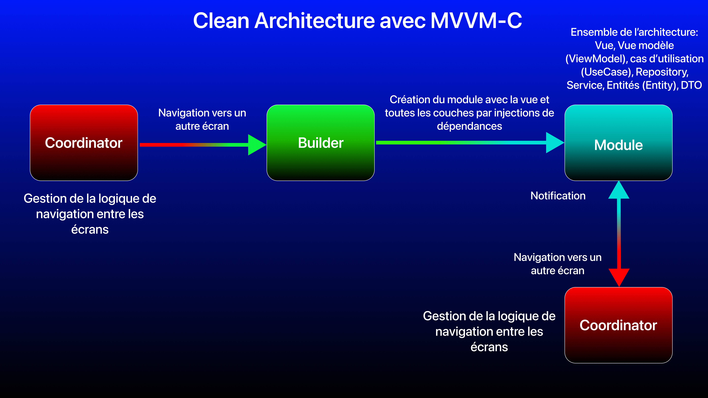
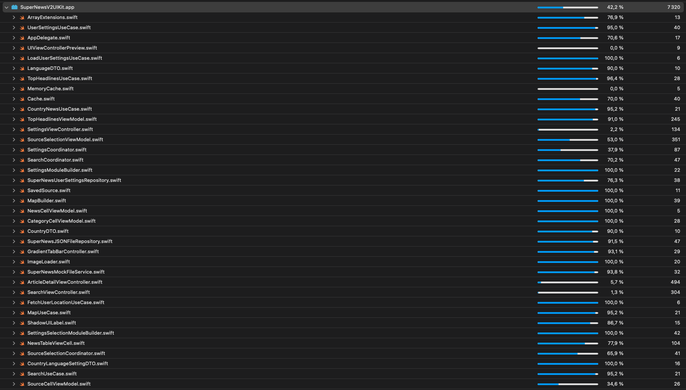
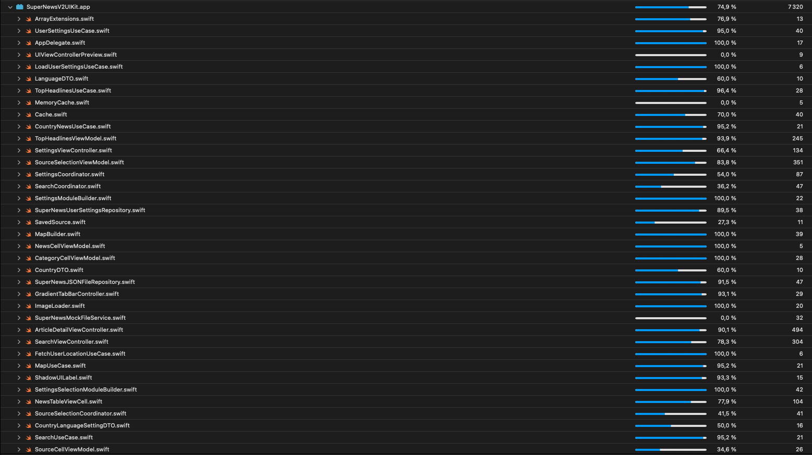
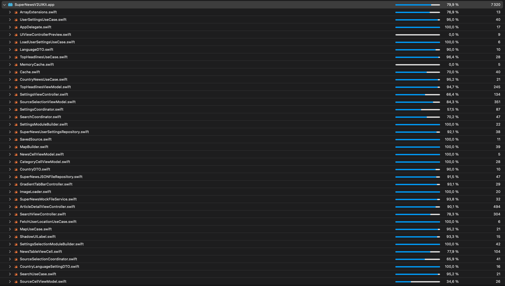

# SuperNews iOS V2 UIKit (Français)

## Plan de navigation
- [Un peu d'histoire](#story)
- [Stack technique et architecture](#stack)
    + [Stack technique](#technology)
    + [Architecture](#architecture)
    + [Design patterns](#patterns)
    + [Récaptiulatif d'architecture](#recap)
- [Important: avant d'essayer l'appli iOS](#important)
- [Fonctionnalités et captures d'écrans](#features)
    + [Actualités](#topHeadlines)
    + [Sélection de source pour les actualités](#sourceSelection)
    + [Recherche de news](#newsSearch)
    + [Carte des news](#map)
    + [Vue détaillée de l'article](#articleDetail)
    + [Paramètres utilisateur](#settings)
- [Tests unitaires et UI](#testing)

## <a name="story"></a>Un peu d'histoire

Pour ce projet personnel qu'est **SuperNews**, tout commence en **2020**. 

J'étais en stage de fin d'études au sein de Capgemini, à Paris, plus précisément à Issy-les-Moulineaux. Mon objectif là-bas était de pouvoir pratiquer dans le dévéloppement iOS natif, un métier et une technologie que j'ai énormément apprécié, étant aussi un passionné de l'écosystème Apple depuis longtemps.

En interne, au sein de la Mobile Factory de la Business Unit DCX (Digital Customer eXperience) Paris, lors de mon upskilling iOS, l'un des leads iOS internes m'a proposé un exercice technique (sous forme de test technique). Et le test technique était le suivant:
- Développer une application qui exploite l'API REST NewsAPI en affichant les articles dans une `TableView`. Au clic sur un article, l’article est affiché (transition `push`) dans un nouvel écran. Ce nouvel écran affiche les détails de l'article.

Le but est donc de montrer ce qu'on a appris pour exploiter une API mais surtout de pouvoir le faire avec différentes architectures, du **MVC** classique, au **MVVM** jusqu'à la **Clean Architecture** (la variante **Clean Swift**). À l'époque, je n'avais réalisé ce test qu'en **MVC**.

Pour voir le test technique en détail, avec mes réalisations que j'ai refait en février 2023, [cliquez ici](https://github.com/Kous92/Test-technique-iOS-2020-Capgemini-Mobile-Factory-DCX-Paris).

**Juillet 2020** arrive, en plein confinement lié à la crise sanitaire mondiale du **COVID** que nous connaissons tous, mon stage s'arrête, et le CDI m'a été refusé (faute de projets clients mais aussi de mon niveau technique insuffisant). J'investis dans un Mac mini pour pouvoir continuer ma progression en iOS natif malgré le moral au plus bas.

Au fil des mois, je passe des entretiens, quasiment tout le temps avec des ESN, et là, au vu de mon parcours, il y a une question qu'on me pose assez fréquemment: **Avez-vous réalisé des projets personnels ?**

Et c'est là que ça m'a fait réfléchir à une idée, car là, il fallait vraiment tout mettre en œuvre pour montrer du concret, un projet complet, avec des fonctionnalités sortant du lot, car oui, une simple interface de type **TODO list** où juste un `TableView` récupérant des données d'une **API REST**, ça ne fera pas son effet. Il faut aller plus loin. Mais avant d'aller plus loin, le challenge ici, c'est d'avoir les ressources serveur pour faire un projet concret, donc une API REST. En général, ce n'est pas donné quand on n'a pas de moyens financiers conséquents, on se retrouve donc limité pour proposer des fonctionnalités.

On est en **mars 2021**, c'est alors que je me remémore ce que j'avais réalisé lors de mon stage de fin d'études chez Capgemini, mon test technique. Ayant gardé le sujet et mon code, j'en ai donc profité pour aller consulter en profondeur la [documentation de NewsAPI](https://newsapi.org). En consultant les différentes features possibles, j'ai donc matérialisé ma première appli avec les features suivantes:
- Actualités du pays favori
- Recherche de news (dans différentes langues possibles)
- Carte des news, ma fonctionnalité signature qui sort du lot, en sélectionnant un pays via son marqueur, de consulter les actualités locales du pays en question.
- Paramètres utilisateur: définir la langue de recherche d'actualités et le pays pour les actualités en favori.

Au niveau technique, j'ai d'abord commencé avec la stack suivante:
- **Xcode 12**, **Swift 5.4**, **UIKit** avec **Storyboard**, l'architecture **MVC** (par défaut sur **UIKit**), **MapKit**, **CoreLocation**, **Alamofire** et **Kingfisher** comme frameworks tiers installés avec **CocoaPods**. Niveau **tests unitaires** et **UI**, c'est un début.

Cette première version m'a pris 2-3 mois pour la réaliser, que j'ai ensuite publié sur **GitHub**. [Cette ancienne version est consultable ici](https://github.com/Kous92/SuperNews-iOS-Swift5/tree/mvc).

Bien que j'ai tout fait pour mettre en avant cette réalisation, techniquement, ça ne suffit pas. Il m'aura fallu le comprendre lors des rares tests techniques et reviews que j'ai pu avoir.

**Octobre 2021**, je lance donc la phase de migration vers l'architecture **MVVM**, ça m'avait pris beaucoup de temps pour enfin comprendre comment implémenter cette architecture avec **UIKit**, je m'étais beaucoup perdu avec tout ce qu'il y avait sur Internet. J'ai retravaillé l'interface utilisateur, j'ai commencé à séparer la logique métier de la vue, et mis en place l'utilisation de **Combine** pour le **data binding** entre la vue et la vue modèle (même si **RxSwift** est au top pour **UIKit** en architecture **MVVM**).

Avec ces améliorations, j'ai senti un net progrès que ce soit pour la logique, la maintenabilité et les tests unitaires (meilleure couverture du code). Mais au fil du temps, j'ai senti que je pouvais faire encore mieux.
Je publie donc cette nouvelle version sur GitHub en décembre 2021, [que vous pouvez consulter ici](https://github.com/Kous92/SuperNews-iOS-Swift5/tree/main).

La stack technique était alors la suivante:
- **Xcode 13**, **Swift 5.5**, **UIKit** avec **Storyboard**, l'architecture **MVVM**, **Combine**, **MapKit**, **CoreLocation**, **Alamofire** et **Kingfisher** comme frameworks tiers installés avec **CocoaPods**, **XCTest** pour les **tests unitaires** et **UI**.

Cette version du projet était pour moi **"mon fidèle allié"** que je présentais à chaque entretien pour montrer mes compétences car c'est un challenge en tant que junior de décrocher un poste de développeur iOS, chose très difficile en raison du contexte économique et des exigences des clients finaux (ESN, cabinets de recrutement).

**2022**, je parviens à travailler chez **Netgem** et **Withings**, pour une période de 3 mois chacune. Ensuite, fin **2022** et début **2023**, je m'engageais dans une **"néo-société de conseil"** pour un recrutement sur profil, donc avec une date de démarrage dès qu'une mission client est gagnée. C'est là que je me suis sensibilisé plus que jamais aux architectures avancées, aux principes du Software Craftsmanship (**KISS**, **DRY**, **YAGNI**, **SOLID**,...), de commencer sur **SwiftUI**, ...

La situation au niveau du marché devenait très compliquée (mon engagement avec l'entreprise prend fin), et avec tout ce que j'ai appris, je me suis lancé comme défi, en **avril 2023** de refaire de zéro cette appli mais en nettement plus améliorée: architecture plus avancée, application des principes du Software Craftsmanship (**KISS**, **DRY**, **YAGNI**, **SOLID**, **design patterns**, ...), mais aussi avec de nouvelles fonctionnalités. Malgré un moral en berne (une nouvelle fois) et une pause, les objectifs de cette nouvelle version sont les suivants:
- De pouvoir pleinement bénéficier de conseils de développeurs expérimentés/experts lors de code reviews pour améliorer mon code, rendre mon app plus performante, faire de meilleurs tests unitaires, ...
- D'être en condition réelle lors d'une mise en production, d'abord sur **TestFlight** et peut être sur l'**App Store** s'il n'y a pas de contraintes au niveau API.
- D'être confronté à davantage de situations techniques que je pourrais rencontrer en milieu professionnel (migration de frameworks, optimisations UI/UX, multithreading, mise en production,...).
- De faire la même version de cette appli iOS en **SwiftUI**.
- De me sentir de plus en plus en confiance, pour être prêt à rechercher de nouveau une entreprise et retrouver un poste de développeur iOS, en étant mieux armé (des tests techniques jusqu'à la validation de la période d'essai).

Là, nous sommes en **Septembre 2023**, et je vous présente donc ma nouvelle version de **SuperNews**, que je publie donc pour la première fois sur **TestFlight** via **App Store Connect**.

Moralité, lorsque le marché est tendu et qu'il faut montrer du concret aux recruteurs, clients, leads **iOS** et chefs de projets, les projets personnels sont un bon moyen de montrer ses compétences dans un projet même si ce projet ne sera pas aussi complet qu'un projet réel en entreprise du fait que nos ressources techniques soit limitées. Un projet personnel riche et complet raconte donc aussi une histoire derrière cette réalisation.

L'idéal est que cette réalisation puisse arriver sur l'**App Store**, mais déjà le mettre sur **TestFlight** est un grand pas, car ce n'est pas tout le monde qui peut d'entrée investir 99€/an pour l'**Apple Developer Program** pour avoir accès à ces ressources.

Dans les parties suivantes, vous aurez un descriptif complet du projet, au niveau technique, fonctionnalités, tests, mise en production, ...

## <a name="stack"></a>Stack technique et architecture

Dans cette partie, je vous décris en détail la solution technique mise en place dans ce projet.
### <a name="technology"></a>Stack technique

Concernant la stack technique, c'est-à-dire l'ensemble des frameworks, technologies et outils utilisés, voici ce que je propose.

**Technologie:** 

L'environnement technologique utilisé est **100% natif iOS**, c'est à dire avec les **<u>technologies officielles d'Apple</u>**:
- **Xcode**: IDE officiel pour le développement d'applications iOS natives. D'abord avec **Xcode 14** puis **Xcode 15 (d'abord en version bêta)**.
- **Swift**: Le langage de programmation officiel d'Apple, utilisé pour tous les composants de l'appli iOS. **Version utilisée: 5.9**.

**Outils:**

Voici les différents outils que j'utilise dans ce projet, qu'il soit int
- **Swift Package Manager**: Outil officiel d'Apple, il s'agit d'un gestionnaire de packages directement intégré à **Swift** et **Xcode**, très pratique pour installer et à mettre à jour des frameworks tiers comme **Alamofire**, **Kingfisher**, **RxSwift**...
- **GitHub**: Le gestionnaire de version et de code décentralisé par l'outil **Git** en ligne. C'est ici que tout l'historique du code et des fichiers y est présent du début jusqu'à maintenant.
- **Postman**: Outil permettant de tester les **API REST (web service)** avec les différentes requêtes **HTTP** qu'une **API** peut proposer.
- **App Store Connect**: Plateforme officielle d'Apple pour la gestion de la mise en production des applis **iOS** et autres plateformes d'Apple. C'est par cette plateforme qu'on peut publier sur **TestFlight** et l'**App Store** les applications. C'est par le biais d'**Xcode** que les applis sont archivées et mises en ligne sur **App Store Connect**.
- **TestFlight**: Plateforme permettant de tester facilement des applis des plateformes Apple en version bêta permettant aux développeurs d'avoir de précieuses évaluations des utilisateurs testeurs avant la publication sur l'**App Store**.

**Frameworks:**
- **UIKit**: Le framework **UI** historique d'Apple pour créer des interfaces d'applications **iOS** natives. Ce framework, permet de manière impérative de construire des vues (notamment des vues complexes avec des interactions avancées), par le biais d'instructions étape par étape pour définir une tâche particulière. **UIKit** fonctionne par le biais de contraintes pour positionner les vues (**Auto Layout**). Parmi les 3 possibilités de faire des vues (programmatique, XIB ou Storyboard), j'ai choisi de le faire de manière programmatique, donc par code.
- **SwiftUI**: Le framework **UI** nouvelle génération d'Apple lancé en 2019, qui permet de manière déclarative de construire des vues et de les prévisualiser en direct, par le biais d'objets où on décrit directement les propriétes (couleur, positionnement, taille, forme, ...). Ici, je l'utilise pour la partie prévisualisation en direct de mes vues réalisées en **UIKit** (notamment les `ViewController`).
- **Swift Concurrency**: Intégré au langage **Swift** depuis la version **5.5**, framework permettant les gestion des tâches asynchrones et du multithreading avec une syntaxe plus légère et plus facile à lire (`async`, `await`, `actor`, `Task`, `@MainActor`)
- **MapKit**: Framework **UI** d'Apple permettant d'utiliser la carte interactive d'iOS de façon personnalisée (vues, interactions,...).
- **Core Location**: Framework d'Apple pour l'utilisation des services de localisation GPS.
- **Combine**: Framework d'Apple pour la programmation réactive (l'équivalent de **RxSwift**), c'est à dire avec des flux asynchrones de données. Le but étant à une entité de s'abonner à un flux émetteur de données et de réagir à tout événement pour exécuter des actions. Ici utilisé pour le `data binding` de l'architecture **MVVM**.
- **XCTest**: Framework d'Apple pour les tests unitaires et les tests UI.
- **SnapKit**: Framework tiers pour gérer plus facilement les contraintes (**Auto Layout**) de vues. Note: avec **SnapKit**, les vues avec **UIKit** sont exclusivement réalisés par code.
- **Kingfisher**: Framework tiers pour télécharger depuis Internet et mettre en cache des images de manière asynchrone.
- **Alamofire**: Framework tiers pour utiliser de manière plus élégante les requêtes réseau.
- **AsyncLocationKit**: Framework pour exploiter `CoreLocation` avec la logique de **Swift Concurrency** (`async/await`) au lieu des `delegate` ou des **completion handlers** (closure: bloc de code qui est utilisé pour gérer l'état de complétion d'une tâche).

Mon application supporte également le **multi-langues**, actuellement en français et en anglais, et j'utilise la nouveauté d'Xcode 15 qu'est le `String catalog` (format `.xcstrings`), qui est bien plus facile à utiliser et à configurer que l'ancienne façon.

### <a name="architecture"></a>Architecture

Pour cette nouvelle version de SuperNews, l'architecture a été retravaillé en repartant sur la version **MVVM**, mais cette fois-ci en y mettant en place des principes du **Software Craftsmanship** (design patterns, principes de **Clean Code**, principes **SOLID**, ...). Cette base de **MVVM** est désormais imbriquée dans une **Clean Architecture**. Aussi pour la navigation, le pattern du `Coordinator` est utilisé, ce qui donne ainsi la variante **MVVM-C**.

Je vais décrire ci-dessous l'architecture (**Clean Architecture avec MVVM-C**) et les patterns utilisés dans ce projet.

### La Clean Architecture

La **Clean Architecture**, par Robert C. MARTIN (alias Uncle Bob), est un principe d'architecture permettant d'organiser et de séparer en couches les responsabilités. Ce principe est indépendant de toute technolgie, plateforme et aussi de toute architecture, en effet, on peut utiliser des architectures comme **MVVM**, **MVP**, **VIP**, **VIPER**,... et les imbriquer dans une **Clean Architecture** en appliquant le principes des couches.

4 couches sont représentées dans le schéma ci-dessous par des cercles concentriques allant de l'extérieur vers l'intérieur, chacune ayant sa responsabilité:
- **Externe (UI ou base de données)**: La partie visuelle de l'application ou une base de données, en fonction de la plateforme et de l'application.
- **Présentation**: La partie qui reçoit les intéractions de l'utilisateur pour exécuter un use case précis (avec ou non des données en entrée) et aussi qui permet de mettre en place des données en sortie afin de notifier la couche externe de se mettre à jour avec ces nouvelles données.
- **Use case (cas d'utilisation)**: logique métier spécifique à un cas d'utilisation (appel réseau API REST, récupération de données d'une base de données pour une appli visuelle, synchronisation avec un service, ...)
- **Entités**: modèles de données définissant une logique bien précise. On appelle aussi cette couche, domaine.

Note: en fonction des plateformes et des implémentations, les couches **use case et entités** peuvent ne faire plus qu'une pour la **couche domaine**.

<br>

Grâce à cette organisation en couches, la **Clean Architecture** assure l'indépendance, garantissant un code flexible étant:
- **Indépendant des frameworks**: les frameworks et librairies tierces doivent être pensés comme des outils, et non des cadres contraignants.
- **Testable indépendamment**: les tests doivent pouvoir être réalisés sans dépendances entre les parties, et sans dépendances à des éléments externes (API, base de données, …).
- **Indépendante de l’interface utilisateur**: l’interface utilisateur doit pouvoir évoluer facilement.
- **Indépendante de la base de données.**
- **Indépendante de tout service ou système externe**: en résumé, le code doit être indépendant des tierces parties dont il n’assure pas le contrôle.

Concernant la relation entre couches, seule une couche extérieure (supérieure) peut dépendre d'une couche intérieure (inférieure), et non l'inverse. De plus chaque couche étant indépendante, la dépendance se fait par le biais d'abstraction, et non de concret. Le dernier principe du **SOLID** s'applique alors, étant l'**inversion de dépendances (D: Depency Inversion)**. Cette architecture permet de s’assurer que les changements apportés sur les couches supérieures n’aient aucun impact sur les couches inférieures, et donc de maintenir une application stable aussi bien au cours de mises à jour de ressources externes, que de tests ou d’évolutions (changement de frameworks, de base de données, etc.).

La **Clean Architecture** va donc faciliter la maintenance et la testabilité du code (adaptée pour la mise en place du **TDD: Test Driven Development**).

Si j'ai correctement appliqué les principes de la **Clean Architecture**, la migration de mes composants peut en théorie se faire plus facilement, comme par exemple si je voudrais passer de **UIKit** vers **SwiftUI** (à condition que les vues soient adaptées aux composants d'architecture, étant donné que les vues **SwiftUI** sont des vues de type valeur et non de type référence avec les vues **UIKit**).

### L'architecture MVVM (la couche présentation de la Clean Architecture)

L'architecture **MVVM** (**Model View ViewModel**) est un design pattern qui permet de séparer la logique métier et les interactions de l'interface utilisateur (UI). Cette architecture se compose en 3 éléments:
- Le **modèle (Model)** représente les différents modèles de données de l'application.
- La **vue (View)** représente l'UI (interface graphique) et les interactions utilisateurs (appui sur un bouton, saisie de texte, ...).
- La **vue modèle (View Model)** est l'intermédiaire entre la vue et le modèle. Ses responsabilités sont de réagir aux actions de l'utilisateur, de gérer la logique métier (ici, récupérer les données du modèle), de formater les données récupérées et mettre à jour la vue en disposant d'attributs que la vue affichera par le biais du data binding (liaison de données).

En **MVVM**, la vue ayant une référence avec la vue modèle, **<u>mais pas l'inverse</u>** (chose qui s'applique avec l'architecture **MVP**), la vue va donc s'abonner à des événements qu'émet la vue modèle.

Le `data binding` est un lien entre la vue et la vue modèle, où la vue par le biais des interactions avec l'utilisateur va envoyer un signal à la vue modèle afin d'effectuer une logique métier spécifique. Ce signal va donc permettre la mise à jour des données du modèle et ainsi permettre l'actualisation automatique de la vue. Le `data binding` en iOS peut se faire par:
- Délégation (déconseillée, plus appropriée pour l'architecture **MVP**, **VIPER**, **Clean Swift (VIP)**)
- Callbacks (closures)
- Programmation réactive fonctionnelle (**RxSwift**, **Combine**), la solution que j'ai retenue ici dans ce projet, avec **Combine**.

<br>

- Principaux avantages:
    + Architecture adaptée pour séparer la vue de la logique métier par le biais de ViewModel
    + `ViewController` allégés.
    + Tests facilités de la logique métier (Couverture du code par les tests renforcée)
    + Adaptée avec **SwiftUI**, **MVVM** est même l'architecture de base.
    + Adaptée pour la programmation réactive (**RxSwift**, **Combine**)

- Inconvénients:
    + Les `ViewModel` deviennent massifs si la séparation des éléments ne sont pas maîtrisés, il est donc difficile de correctement découper ses structures, classes et méthodes afin de respecter le premier principe du **SOLID** étant le principe de responsabilité unique (**SRP: Single Responsibility Principle**). La variante **MVVM-C** qui utilise un `Coordinator` s'avère utile pour alléger les vues et gérer la navigation entre vues.
    + Potentiellement complexe pour des projets de très petite taille.
    + Inadaptée pour des projets de très grande taille (surtout si la logique métier est massive), il sera préférable de passer à l'architecture **VIPER** ou à la Clean Architecture (**VIP (Clean Swift)**, **MVVM**, ...). **MVVM** est donc intégrable dans une **Clean Architecture**, ce qui est le cas ici dans ce projet.
    + Maîtrise compliquée pour les débutants avec **UIKit**, mais plus simple avec **SwiftUI** (étant l'architecture "par défaut").

### La variante MVVM-C avec le Coordinator

Étant donné qu'avoir un code bien découplé et qui respecte au mieux le premier principe du **SOLID** étant le principe de responsabilité unique, l'architecture **MVVM** doit être modifiée étant donné qu'elle ne respecte pas ce principe. Pour cela, en plus d'isoler la logique métier dans la couche domaine, la navigation sera elle isolée dans une entité dédiée qu'est le `Coordinator`. **MVVM** + `Coordinator` = **MVVM-C**.

Le `Coordinator` est un pattern qui organise la logique de flux de navigation entre les différents écrans (ViewController) et qui isole la logique de navigation de l'interface utilisateur.

L'objectif principal du `Coordinator` est de rendre le code plus modulaire et plus facilement testable en réduisant la dépendance entre les différents composants de l'application. Il permet également de réduire la complexité de l'architecture de l'application en divisant les responsabilités de chaque composant.

Le `Coordinator` se met en place avec une classe contenant des méthodes pour afficher le premier écran (depuis `AppDelegate` ou `SceneDelegate`), naviguer d'un écran à un autre, et des attributs pour gérer les références entre les différents coordinators (étant des sous-flux). Le principe de communication entre la vue et le `Coordinator` se fait idéalement avec la délégation (`delegate`) afin de bien respecter le 4ème et 5ème principe du **SOLID**, qui va permettre par exemple de faire passer des données à une précédente vue mais aussi pour faciliter la testabilité et la maintenance du fait que la vue est découplée du `Coordinator`.

Le `Coordinator` est donc l'une des possibles options pour gérer le flux de navigation et donc d'isoler la logique de navigation entre les vues. Il y en a d'autres comme le routeur (`Router`), et l'architecture **VIPER** en est un exemple qui implémente cette façon de naviguer.

On en retiendra que le `Coordinator` est un pattern de flux:
- Qui gère la navigation dans des flux et sous-flux, en allégeant la vue de cette responsabilité.
- Qui permet le découplage des différents écrans afin de faire une navigation sur mesure que ce soit lors des interactions sur chaque écran, ou bien lors de l'ouverture de l'application avec des deeplinks (liens profonds).
- Qui facilite la testabilité des composants de l'application, chaque flux de navigation pouvant être testé indépendamment, par exemple pour vérifier que les instances sont bien retournées ou bien détruites depuis des tests unitaires.

Mais aussi un pattern difficile à apprendre, à comprendre et à appliquer par soi-même. C'est un pattern qui m'a donné énormément de fil à retordre. Il faut faire très attention à la gestion des références pouvant facilement causer des rétentions de cycles résultant de fuites mémoire (`memory leak`).

Dans ce projet, on s'assure déjà en premier lieu que chaque `ViewController` est indépendant des autres:
- Un initialiseur est mis en place, c'est le `Coordinator` qui gère l'instanciation des `ViewController` avec la méthode `start()` dédiée.
- Pas d'interaction de navigation (`push`, `present`, `segue`, ...). C'est au `Coordinator` de gérer la navigation.

Pour chaque interaction d'une vue à une autre, c'est le `ViewModel` associé au `ViewController` qui aura une référence faible (`weak`) vers le `Coordinator` par le biais d'une abstraction sous forme de `delegate`, la référence forte étant indirectement du `Coordinator` vers le `ViewController` (qui lui-même a une référence vers le `ViewModel`).

### <a name="patterns">Designs patterns utilisés

Pour mettre en place la **Clean Architecture** et les différents principes de **Clean Code** et du **SOLID**, voici donc les différents design patterns utilisés:
- **Délégation (`delegate`)**: Le pattern qui permet à une classe de déléguer certaines de ses responsabilités à une autre classe. Elle facilite donc la communication entre classes et délivre des messages d'un objet à un autre lorsqu'un événement spécifique se déclenche. Utilisée avec le `Coordinator` (pour communiquer avec le `ViewModel`), les vues **UIKit** comme `TableView`, `CollectionView`, `MKMapView`, `SearchBar`, ...
- **Injection de dépendances**: Le pattern où un objet reçoit d'autres objets dont il dépend de manière dynamique afin d'éviter une dépendance directe entre deux classes. L'injection de dépendances permet de réduire le couplage, d'avoir un code réutilisable, testable et maintenable. Ici, l'injection de dépendances s'effectue par initialiseur en fournissant l'(les) instance(s) que l'objet a besoin.
- **Monteur (`Builder`)**: Pattern permettant d'initialiser des objets complexes étape par étape. Il permet de produire différentes variations ou représentations d’un objet en utilisant le même code de construction. Ici dans notre cas, il sera utilisé pour créer le module associé à l'écran en cours, c'est à dire instancier un `ViewController` avec les dépendances qu'il a besoin par le biais d'injections de dépendances (On peut aussi l'adapter pour les tests unitaires). Un module complet en couches selon la **Clean Architecture** se compose comme ceci:
    + `ViewController` -> `ViewModel` -> `UseCase` -> `Repository` -> `Service`
    + Exemple ci-dessous:
```swift
final class TopHeadlinesModuleBuilder: ModuleBuilder {
    private var testMode = false
    
    func buildModule(testMode: Bool, coordinator: ParentCoordinator? = nil) -> UIViewController {
        self.testMode = testMode
        let topHeadlinesViewController = TopHeadlinesViewController()
        
        // Injections de dépendances
        let dataRepository = getRepository(testMode: testMode)
        let settingsRepository = getSettingsRepository(testMode: testMode)
        let userSettingsRepository = getUserSettingsRepository(testMode: testMode)
        let useCase = TopHeadlinesUseCase(dataRepository: dataRepository, sourceSettingsRepository: settingsRepository, userSettingsRepository: userSettingsRepository)
        let topHeadlinesViewModel = TopHeadlinesViewModel(useCase: useCase)
        topHeadlinesViewModel.coordinator = coordinator as? TopHeadlinesViewControllerDelegate
        
        // Injection du ViewModel
        topHeadlinesViewController.viewModel = topHeadlinesViewModel
        
        return topHeadlinesViewController
    }
    
    private func getRepository(testMode: Bool) -> SuperNewsRepository {
        return SuperNewsDataRepository(apiService: getDataService(testMode: testMode))
    }
    
    private func getSettingsRepository(testMode: Bool) -> SuperNewsSourceSettingsRepository {
        return SuperNewsSourceUserDefaultsRepository(settingsService: getSettingsService(testMode: testMode))
    }
    
    private func getUserSettingsRepository(testMode: Bool) -> SuperNewsSettingsRepository {
        return SuperNewsUserSettingsRepository(settingsService: getUserSettingsService(testMode: testMode))
    }
    
    private func getDataService(testMode: Bool) -> SuperNewsDataAPIService {
        return testMode ? SuperNewsMockDataAPIService(forceFetchFailure: false) : SuperNewsNetworkAPIService()
    }
    
    private func getSettingsService(testMode: Bool) -> SuperNewsLocalSettings {
        return testMode ? SuperNewsMockLocalSettings() : SuperNewsUserDefaultsLocalSettings()
    }
    
    private func getUserSettingsService(testMode: Bool) -> SuperNewsUserSettings {
        return testMode ? SuperNewsMockCountryLanguageSettings(with: "country") : SuperNewsUserDefaultsCountryLanguageSettings(with: "country")
    }
}
```
- **Coordinator**: Le pattern qui gère la navigation entre les écrans.
- **DTO (Data Transfer Object)**: Le pattern qui permet de transférer des données de manière plus contrôlée de la couche des services (réseau, GPS, base de données,...) vers la couche présentation et vice-versa, ici par le biais du **Repository**. C'est un objet simple contenant les attributs, un accesseur (`getter`), un mutateur (`setter`) et un initialiseur provenant des entités liés au service utilisé. Inversement, une entité peut être créée par le biais d'un DTO (comme objet de requête par exemple).
- **Use case:** Le pattern qui gère la logique métier (qui va ordonner les actions à exécuter comme récupérer des données), tout en étant indépendant de tout framework. L'intermédiaire ici entre le `ViewModel` et le `Repository`. Les entités utilisés sont des **DTO**, dans la couche domaine de la **Clean Architecture** (**Use case + Entités**).
- **Repository:** Le pattern faisant office d'abstraction des couches externes de données (réseau, GPS, Bluetooth, base de données, fichiers,...). Il s'agit donc d'un point d'entrée et de sortie de données faisant ainsi l'intermédiaire entre la couche domaine et la couche de données. C'est le `Repository` qui connaît le service qui est utilisé pour récupérer et envoyer des données, mais également les entités liées à la couche de données. Il convertit également les données récupérées en **DTO** et inversement lors d'une requête.

### <a name="recap"></a>Récapitulatif d'architecture

Au niveau de l'architecture, je vous décris par le biais de diagrammes comment s'est construite l'architecture de mon appli iOS.

**La logique de navigation par le biais des `Coordinator` ci-dessous:**


Par le biais de cette logique, voici donc comment se construit un module constituant les différentes couches de la **Clean Architecture** ci-dessous:



Voici donc comment se consitue un module, initialement créé par un `Builder`, où les injections de dépendances s'effectuent entre couches et renvoyant le `ViewController` instancié par le `Coordinator`:


## <a name="important"></a>IMPORTANT: À LIRE AVANT D'ESSAYER L'APPLI iOS

Si vous souhaitez faire tester l'application directement via **TestFlight**, [cliquez ici depuis votre iPhone/iPad](https://testflight.apple.com/join/SKj6fn5k).

Si vous souhaitez faire exécuter l'application par le biais d'Xcode en faisant un build du projet, lisez cette partie ci-dessous.

L'appli exploite l'API REST de **NewsAPI**, une clé d'API est donc requise. Pour cela, obtenez votre clé sur le site de [NewsAPI](https://newsapi.org/), dans la rubrique **Account** du compte que vous avez créé:<br>
<br>

**Pour des raisons de sécurité, le fichier ApiKey.plist n'est pas présent dans le repo GitHub**.<br>

Une fois la clé récupérée, créez un fichier **ApiKey.plist**, en le plaçant dans le même emplacement du dossier DataLayer du projet **Xcode**, où se situent les fichiers storyboard. Créez alors une propriété de type **String** avec `apiKey` en tant que clé, et la clé d'API que vous avez récupérée en tant que valeur. Prenez exemple comme ci-dessous:
<br>

Ou bien dans dans ce même fichier en y ajoutant le code sous format XML et en y mettant sa clé d'API entre les balises `</string>`:
```xml
<?xml version="1.0" encoding="UTF-8"?>
<!DOCTYPE plist PUBLIC "-//Apple//DTD PLIST 1.0//EN" "http://www.apple.com/DTDs/PropertyList-1.0.dtd">
<plist version="1.0">
<dict>
	<key>apiKey</key>
	<string>VOTRE CLÉ D'API</string>
</dict>
</plist>
```

La clé sera ensuite récupérée par la fonction privée ci-dessous de la classe `NewsAPIService`, en lisant le contenu du fichier **plist** créé au préalable et initialisé depuis le constructeur de `SuperNewsNetworkAPIService`.
```swift
final class SuperNewsNetworkAPIService: SuperNewsDataAPIService {
    private var apiKey: String = ""
    
    fileprivate func getApiKey() -> String? {
        guard let path = Bundle.main.path(forResource: "apiKey", ofType: "plist") else {
            print("[SuperNewsNetworkAPIService] ERROR: apiKey.plist file does not exists")
            return nil
        }
        
        guard let dictionary = NSDictionary(contentsOfFile: path) else {
            print("[SuperNewsNetworkAPIService] ERROR: Data not available")
            return nil
        }
        
        return dictionary.object(forKey: "apiKey") as? String
    }
    
    private func getAuthorizationHeader() -> HTTPHeaders {
        return [.authorization(bearerToken: apiKey)]
    }
    
    init() {
        self.apiKey = getApiKey() ?? ""
        ...
    }
}
```

## <a name="features"></a>Fonctionnalités et captures d'écran

Voici les différentes fonctionnalités que je propose dans l'application **SuperNews**:
- Actualités
- Sélection de source pour les actualités
- Recherche de news
- Carte des news
- Vue détaillée de l'article
- Paramètres utilisateur

### <a name="topHeadlines"></a>Actualités

En tapant sur **Actualités** dans la barre de navigation du bas, l'interface des news apparaît comme ceci avec les news locales téléchargées et affichées avec leurs images (par défaut ceux de la France, le pays change en fonction du paramètre choisi).

En tapant sur une actualité de la liste, une vue montrant les détails de l'article apparaît, [plus de détails ici](#articleDetail).

En ayant bien exploité en profondeur l'API REST NewsAPI, voici une nouveauté: une vue défilante horizontale (`CollectionView`) va ici représenter les différentes catégories d'actualités:
- Les actualités locales en fonction du pays choisi dans les paramètres(France par défaut).
- Les actualités d'un média en particulier (votre favori). Vous pouvez le définir en tapant sur le [bouton en haut à gauche de l'écran pour choisir votre média favori](#sourceSelection).
- Business
- Divertissement
- Général
- Santé
- Science
- Sports
- Technologie

Ces 7 catégories d'actualités dépendent du pays choisi dans les paramètres, comme pour les actualités locales.


### <a name="sourceSelection"></a>Sélection de source pour les actualités

Dans cet écran, vous avez la possibilité de choisir une source de news en favori parmi celles disponibles. Les sources sont téléchargées la première fois puis affichées dans une liste.

La vue défilante horizontale fait office de filtre pour trier la liste des sources selon 4 options:
- Toutes les sources: par défaut. La liste des sources téléchargées telles quelles.
- Par langue: Les sources sont triées dans chaque section représentant une langue, ici 14.
- Par catégorie: Toutes langues et pays confondu, les sources sont triées dans chaque section de la liste: Business, Divertissement, Général, Santé; Science, Sports, Technologie.
- Par pays: Les sources sont triées dans chaque section représentant une pays, ici 54.

Pour plus d'ergonomie, vous avez la possibilité avec la barre de recherche de rechercher une source parmi celles disponibles.

Tapez sur une source, et vous serez redirigé vers l'écran des actualités. La source choisie est sauvegardée et lorsque vous séléctionnerez la 2ème cellule de la liste horizontale, vous aurez alors les actualités de la source sélectionnée.


### <a name="newsSearch"></a>Recherche de news

En tapant sur **Recherche** dans la barre de navigation du bas, l'interface des news apparaît comme ceci avec les news locales téléchargées et affichées avec leurs images (par défaut ceux de la France, le pays change en fonction du paramètre choisi).

Pour rechercher le contenu, il suffit tout simplement de toucher la barre de recherche puis de saisir le contenu recherché. La recherche est réactive, chaque modification distincte dans la barre de recherche va automatiquement déclencher un appel HTTP de l'API REST et mettre à jour la liste s'il y a du contenu.

Par défaut la langue des news est en français. Lorsque vous avez séléctionné une news, une vue défilante (`ScrollView`) apparaît pour y voir les détails de l'article. Le bouton en bas de la vue vous permet de consulter le site de la source de l'article afin de lire l'article dans son intégralité.<br>


### <a name="map"></a>Carte des news

Avec les possibilités que donne **NewsAPI**, il est donc possible de récupérer les news en tendance de 54 pays différents dans le monde entier. Je propose donc ici une option de carte interactive où des marqueurs personnalisés apparaîssent sur la carte représentant les pays en question.

Avec la localisation GPS, vous avez la possibilité de centrer la carte sur le pays le plus proche de votre position actuelle (par rapport à son emplacement sur la carte).

En sélectionnant **Oui**, la carte sera centrée sur le pays suggéré. Si vous êtes localisé dans l'un des 54 pays disponibles, la carte sera centrée dans le même pays.


Si vous êtes localisé dans un pays qui ne fait pas parti des 54 pays, la carte sera centrée dans le pays suggéré le plus proche, le calcul se faisant avec les distances **<u>à vol d'oiseau</u>** entre la position actuelle et le marqueur le plus proche.


En sélectionnant **No**, la carte sera centrée sur votre position.


**Concernant les marqueurs, plusieurs options possibles:**
- Avec l'ajout du **clustering**, si vous réduisez le zoom vers une altitude élevée, les marqueurs se regrouperont en un marqueur affichant le nombre de pays dans ce groupe (cluster). Tapez sur ce marqueur pour zoomer sur le groupe et faire apparaître les marqueurs en question.
- Le bouton en bas à gauche vous permet d'avoir un zoom global de la carte à une altitude de 15 000 km.
- Si vous avez autorisé le service de localisation, vous aurez un bouton en bas à droite de l'écran (au-dessus du `TabBar` en bas de l'écran) qui vous permettra de centrer la carte sur votre position actuelle, à une altitude de 10 km.


La barre de recherche en haut vous permettra de center la carte sur les pays à leurs positions respectives. En la touchant, une liste d'autocomplétion apparaît et change par un filtrage en fonction de la saisie. Par exemple, si je veux centrer la carte sur le Japon, je valide ma recherche soit en saississant le nom du pays, soit en sélectionnant sa cellule de la liste d'autocomplétion, et cela va donc centrer la carte sur le pays et le marqueur en question.<br>

En tapant sur le marqueur du pays représenté de la carte, un écran affichant les news locales du pays apparaîtra. La fonctionnalité est similaire à celle des actualités.<br>


### <a name="articleDetail"></a>Vue détaillée de l'article

Lorsque vous avez séléctionné une actualité, une vue défilante (`ScrollView`) apparaît pour y voir les détails de l'article. Le bouton en bas de la vue vous permet de consulter le site de la source de l'article afin de lire l'article dans son intégralité. Le bouton en haut à gauche de la vue vous permet de partager le lien vers le site de l'article en question (par message, vos réseaux sociaux, AirDrop, ...).


### <a name="settings"></a>Paramètres utilisateur

Pour les paramètres, vous pouvez définir votre pays favori des news en sélectionnant **Pays des news** puis le pays de votre choix parmi les 54 disponibles (par exemple les États-Unis). Une fois sélectionné, allez dans **Actualités** et vous verrez les news locales des États-Unis.<br>


Pour la langue, même chose depuis les paramètres, en sélectionnant "Langue des news" puis la langue de votre choix parmi les 14 langues disponibles (exemple: Anglais). Avec la langue sélectionnée, allez dans **Actualités** et vous verrez dans la barre de recherche la langue sélectionnée (ici: **Anglais** par exemple) et en recherchant un contenu dans la langue choisie, les news s'afficheront s'il y en a de disponibles.


La dernière option permet de réinitialiser les paramètres par défaut pour le pays et la langue des news.


## <a name="testing"></a>Tests unitaires et UI

Dans tout développement d'applications iOS, comme sur d'autres plateformes, les tests unitaires et UI (User Interface, traduisez par interface utilisateur) sont essentiels pour vérifier le bon fonctionnement de l'application avant les alpha et bêta tests par des utilisateurs et sa mise en production sur l'App Store.

En iOS natif, on utilise le framework **XCTest**. Avec l'architecture que je propose aujourd'hui, une Clean Architecture avec MVVM-C, chaque composant est indépendant afin d'être testé plus facilement, à condition bien sûr de connaître les bonnes techniques pour tester (abstractions, mocks, stubs, spy, ...). Même avec une architecture appropriée, la principale difficulté est de savoir quoi tester et de quelle façon le tester.

Certaines parties du code de l'application restent tout de même plus difficiles à tester comme les `ViewController` par exemple.

### Tests unitaires (White box)

Les tests unitaires sont les tests en boîte blanche **(White box)** où on a une visibilité sur le code, afin de tester les fonctionnalités de l'application. Les tests unitaires sont des tests courts et rapides à exécuter. C'est aussi là qu'on peut tester les différentes couches de l'architecture du projet en injectant des mocks par exemple. Je propose en tout **94 tests unitaires indépendants**.

Je ne connais pas encore toutes les techniques pour faire de meilleurs tests unitaires, mais une fois cela assimilé, la couverture du code par les tests augmentera de manière significative.

Ces tests unitaires couvrent actuellement **39,9%** du code de l'application.



### Tests UI automatisés (Black box)

Les tests UI sont les tests en boîte noire **(Black box)** où on n'a pas de visibilité sur le code, mais une visibilité sur l'interface visuelle. Pour cela, **XCTest** utilise `XCUIApplication` pour permettre de simuler les interactions d'une application de façon automatique, et de vérifier l'existence des élements attendus dans l'interface. L'architecture de l'application importe peu dans les tests UI, l'essentiel étant de tester comme un utilisateur lambda, en ciblant donc les composants **UI** de l'application. Par rapport au tests unitaires, la couverture du code est donc plus élevée, mais en contrepartie de tests qui peuvent être longs à exécuter.

C'est également cette partie-là que dans un projet en entreprise qu'une équipe de testeurs, qu'on appelle aussi **QA (Quality Assurance)** sont impliqués dans la mise en place des tests automatisés des applications avec des frameworks ou outils externes à **Xcode**.

Côté développeur iOS avec **Xcode**, les tests UI s'effectuent de la même manière que des tests unitaires.

Ces tests UI couvrent actuellement **74%** du code de l'application.



### Au niveau global pour les tests

En exécutant les 114 tests unitaires et UI, la couverture actuelle du code est de **79%**.

